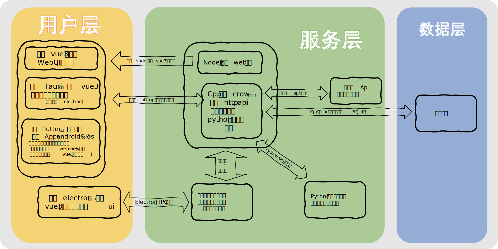

# MedImgAIAnalyzer 的 文档仓库
---
# 目录树
```
MedImgAIAnalyzer-docs
├── 架构图.svg
├── 前端项目介绍.txt
└── README.md
```
---

[前端项目介绍](前端项目介绍.md)

---

## 相关仓库

- [MedImgAIAnalyzer-vue3](https://github.com/Rare-Specie/MedImgAIAnalyzer-vue3) — Vue3 前端
- [MedImgAIAnalyzer-cppServer](https://github.com/Rare-Specie/MedImgAIAnalyzer-cppServer) — C++ 后端

---

## 架构图（临时）


