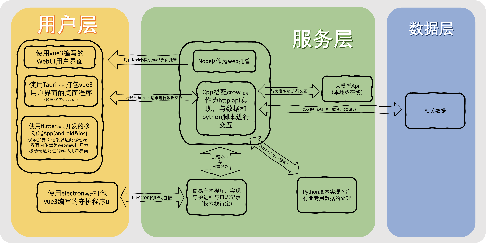

# MedImgAIAnalyzer 的 文档仓库
请注意，文档可能会有问题，如有问题请联系文档编撰者进行修复

---

## 本项目的代码仓库

- [MedImgAIAnalyzer-vue3](https://github.com/Rare-Specie/MedImgAIAnalyzer-vue3) — Vue3 前端
- [MedImgAIAnalyzer-cppServer](https://github.com/Rare-Specie/MedImgAIAnalyzer-cppServer) — C++ 后端
- [MedImgAIAnalyzer-tools](https://github.com/Rare-Specie/MedImgAIAnalyzer-tools) — 一些小工具
- [One-key_U-SAM](https://github.com/RareSpecies233/One-key_U-SAM) — 修改过的一键可在windows训练的脚本
- [Tiny-RAG-LLM](https://github.com/RareSpecies233/Tiny-RAG-LLM) — 使用在线LLM API的简易RAG项目
- [MedImgClient](https://github.com/RareSpecies233/MedImgClient) — 客户端/守护进程

---

## 文档：

- [api文档](https://github.com/Rare-Specie/MedImgAIAnalyzer-cppServer/blob/main/Api.md)
- [前端项目介绍.md](https://github.com/Rare-Specie/MedImgAIAnalyzer-vue3/blob/main/%E5%89%8D%E7%AB%AF%E9%A1%B9%E7%9B%AE%E4%BB%8B%E7%BB%8D.md)
- [论文Pdf](s43856-025-00953-0.pdf)
- [已有数据 - Medical data preprocessingV1说明.md](Medical%20data%20preprocessing说明.md)
- [U-SAM说明.md](U-SAM说明.md)

**注意**：小工具文档请见其Readme  
**注意**：可能文档未列举完全，请check各个仓库

---

## 参考仓库

- [kanydao/U-SAM](https://github.com/kanydao/U-SAM) — U-SAM论文的GitHub代码部分 以及 **如何获取数据源**  
关于此仓库中代码，已做解析，见[U-SAM说明.md](U-SAM说明.md)

---

## 已有的代码(**Medical data preprocessing**)
**Medical data preprocessing**中已使用python实现了部分所需功能的代码，仅参考使用，将会重构所有代码  
**注意:代码已更新V2**

目前仅有[V1的说明](Medical%20data%20preprocessing说明.md)
- [V2 压缩包[7z]](Medical%20data%20preprocessingV2.7z)
- [V2 GitHub在线查看](Medical%20data%20preprocessingV2)
- ~~[V1 压缩包[7z]](Medical%20data%20preprocessing.7z)(已过时)~~
- ~~[V1 GitHub在线查看](Medical%20data%20preprocessing)(已过时)~~

---

## ~~架构图（已过时）~~

